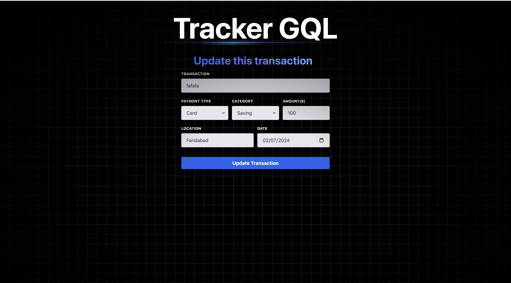

# TrackerGQL 

TrackerGQL is a smart expense management application that allows you to track and manage your expenses on the fly. The app provides a convenient way to add expenses, specifying details such as amount, type (saving, expense, investment), payment type, location, and date. An interactive chart displays the distribution of your expenses, giving you a clear overview of your spending. You can also edit or delete existing transactions, making it easy to keep your records up to date.

## Features

- **Expense Management:** Easily add and manage your expenses with detailed information, including amount, type, payment type, location, and date.
- **Interactive Chart:** Visualize the distribution of your expenses through an interactive chart.
- **Transaction Editing:** Update the details of your existing transactions as needed.
- **Transaction Deletion:** Remove transactions that are no longer needed.

## Tech Stack

- **Frontend:** React.js, Apollo Client, Tailwind CSS
- **Backend:** Node.js, Express, GraphQL
- **Database:** MongoDB

## Live Demo

[Visit the live application](https://trackergql.onrender.com/)

## Screenshots

Here are some screenshots of the TrackerGQL application:





## Getting Started

To run this application locally, follow these steps:

1. Clone the repository:
   ```sh
   git clone https://github.com/akhilmw/TrackerGQL.git
   ```
2. Navigate to the project directory
   ```
   cd TrackerGQL
   ```
3. Install the dependencies:
   ```
   npm run build
   ```
4. Start the development server:
   ```
   npm run dev
   ```
   
## Contributing

1. Fork the repository.
2. Create your feature branch (`git checkout -b feature/fooBar`).
3. Commit your changes (`git commit -am 'Add some fooBar'`).
4. Push to the branch (`git push origin feature/fooBar`).
5. Create a new Pull Request.

     
